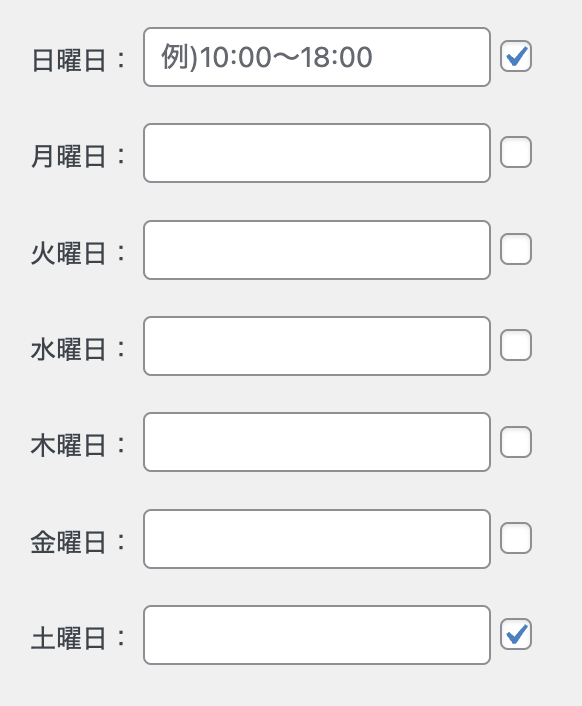
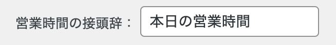
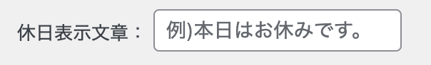
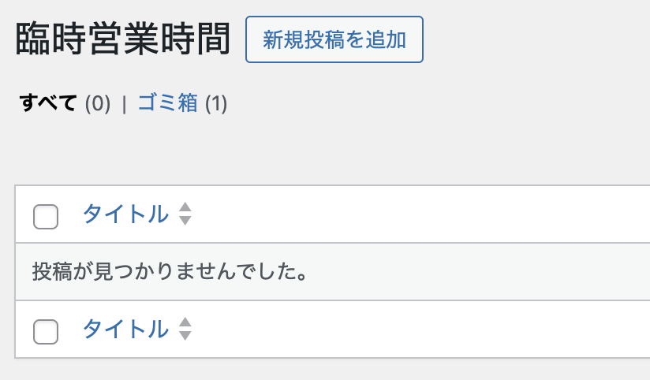
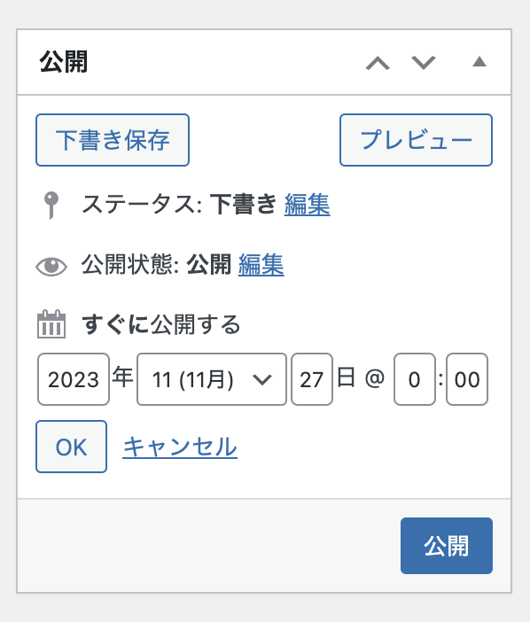
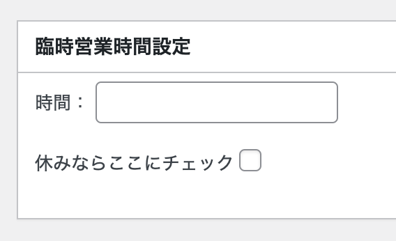

# business-hours

WordPress用の営業時間表示プラグインです。管理画面で曜日ごとの営業時間を設定しておくと、ショートコード `[business_hours]` を貼るだけで「本日の営業時間」を自動表示します。臨時休業・臨時営業時間にも対応しています。

## 主な機能

- 曜日ごとの営業時間・定休日を管理画面から設定
- 営業時間表示の接頭辞（例：「本日の営業時間」）を自由に設定
- 定休日に表示する文言を自由に設定
- カスタム投稿タイプ「臨時営業時間」による、特定日だけの臨時休業・臨時営業時間の登録（通常設定より優先されます）
- ショートコード1つで記事・固定ページに表示可能

## インストール

1. `business-hours` フォルダごと `wp-content/plugins/` 以下に配置します。
2. WordPress管理画面の「プラグイン」から `business-hours` を有効化します。

有効化すると、左メニューに時計アイコンの「営業時間追加」が追加されます。

## 使い方

### 1. 基本の営業時間を登録する

「営業時間追加」画面で、曜日ごとに営業時間を入力します。定休日はチェックボックスにチェックを入れれば、時間の入力は不要です。



### 2. 営業時間の接頭辞を設定する

営業時間の前に表示する語句を入力します。



例えば「本日の営業時間」と設定すると、以下のように表示されます。

> **本日の営業時間** 10:00〜18:00

### 3. 定休日の表示文言を設定する

定休日に表示したい文章を入力します。



### 4. 臨時営業時間を登録する

特定の日だけ営業時間や休業を変更したい場合は、「臨時営業時間」メニューの「新規投稿を追加」から登録します。



1. 「公開」パネルから、公開日時を臨時で表示したい日付に設定します。

   

2. 休業日にする場合は、「休みならここにチェック」にチェックを入れます。
3. 営業時間を変更する場合は、「時間：」に臨時の営業時間を入力します。

   

### 5. ショートコードを設置する

表示させたい記事・固定ページに以下のショートコードを挿入します。

```
[business_hours]
```

出力されるHTMLの各要素にはIDが付与されており、CSSで自由に装飾できます。

| 要素 | id |
| --- | --- |
| 接頭辞 | `message_bh_prefix` |
| 営業時間 | `bh_time` |
| 定休日用の文章 | `message_holiday` |

## 表示の優先順位

1. 当日に該当する「臨時営業時間」の投稿がある場合は、その内容（休業 or 臨時営業時間）
2. なければ、通常の曜日設定（営業時間 or 定休日文言）

## 困ったときは・不具合報告

imo_watch@icloud.com までご連絡ください。
